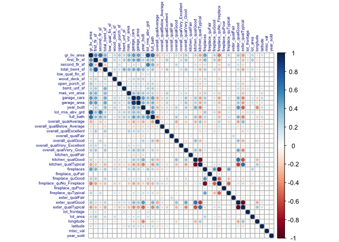
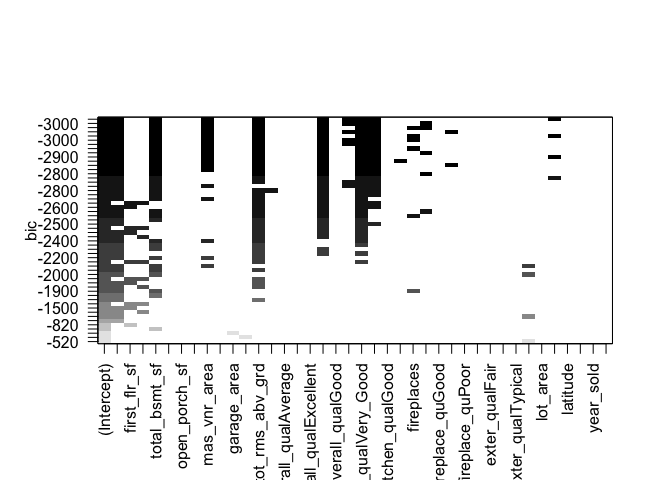
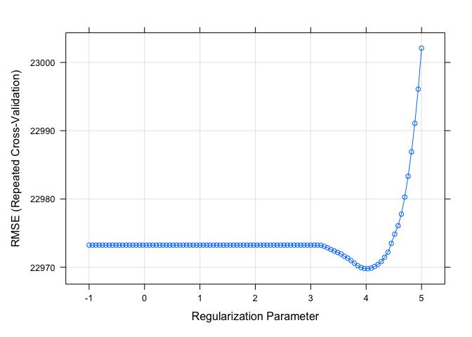
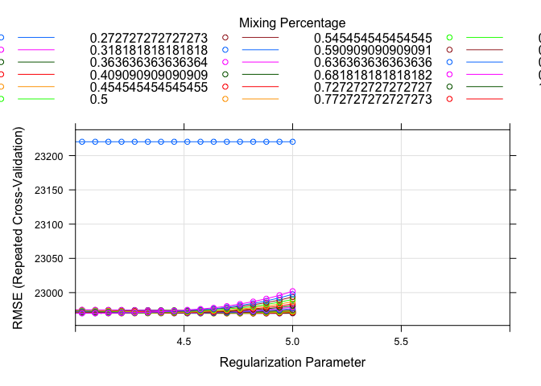

Home Work 2 for Data Science II
================
Roxy Zhang (rz2570)
2/12/2022

### Setup and import data

``` r
library(tidyverse)
library(caret)
library(corrplot)
library(leaps)
```

``` r
train_df = 
  read_csv("data/housing_training.csv") %>% 
  janitor::clean_names() %>% 
  na.omit()

test_df = 
  read_csv("data/housing_test.csv") %>% 
  janitor::clean_names() %>% 
  na.omit()

dim(train_df)
```

    ## [1] 1440   26

``` r
table(sapply(train_df[ , -1], class)) %>% 
  knitr::kable()
```

| Var1      | Freq |
|:----------|-----:|
| character |    4 |
| numeric   |   21 |

``` r
dim(test_df)
```

    ## [1] 959  26

``` r
table(sapply(test_df[ , -1], class)) %>% 
  knitr::kable()
```

| Var1      | Freq |
|:----------|-----:|
| character |    4 |
| numeric   |   21 |

-   We want to predict outcome variable `sale_price` by selecting
    predictors from 26 variables, among which there are 4 categorical
    variables and 21 continuous variables.  
-   There are 1440 data in training data and 959 in test data.

### Data preparation

For the convenience of fitting models, we want to create vectors and
matrices in advance:

``` r
train_x <- model.matrix(sale_price ~ ., train_df)[ ,-1]
train_y <- train_df$sale_price
test_x <- model.matrix(sale_price ~ ., test_df)[ , -1]
test_y <- test_df$sale_price
test_all <- model.matrix(sale_price ~ ., test_df)
```

In linear regression, correlation among variables can cause large
variance and make interpretation harder.  
So we want to have a look and the potential correlation among
predictors:

``` r
corrplot(
  cor(train_x), 
  method = "circle",
  type = "full",
  tl.cex = .5, 
  tl.col = "darkblue")
```

<!-- -->

-   From the plot above, we can see some positive correlations in the
    upright corner among some area-related predictors such as
    `gr_liv_area` and `second_flr_sf`, and also negative correlations
    among categorical variables such as `exter_qualTypical` and
    `kitchen_qualTypical`.  
-   To reduce the influence of correlation, we may want to reduce the
    number of predictors using best subset model selection.

``` r
lm_subsets <- regsubsets(sale_price ~ .,
                         data = train_df,
                         method = "exhaustive",
                         nbest = 6)
```

    ## Warning in leaps.setup(x, y, wt = wt, nbest = nbest, nvmax = nvmax, force.in =
    ## force.in, : 1 linear dependencies found

    ## Reordering variables and trying again:

``` r
plot(lm_subsets, scale = "bic")
```

<!-- -->

``` r
# Look at actual numbers of predictors
# summary(lm_subsets)
```

-   The plot above gives us a sense of model selsction. Hoever, we will
    stick to using all the predictors in this assignment.

## Least Squares

Fit a linear model using least squares on the training data. Is there
any potential disadvantage of this model?

### Model fitting

``` r
set.seed(2570)

# Specify resampling method
ctrl <- trainControl(method = "repeatedcv", number = 10, repeats = 5)

# Fit a linear model using caret
lm_fit <- train(sale_price ~ .,
                data = train_df,
                method = "lm",
                preProcess = c("center", "scale"),
                trControl = ctrl)
 
# Extract coefficiencts
round(lm_fit$finalModel$coefficients, 3) %>% 
  knitr::kable()
```

|                            |          x |
|:---------------------------|-----------:|
| (Intercept)                | 177568.502 |
| gr_liv_area                |  11918.089 |
| first_flr_sf               |  15645.580 |
| second_flr_sf              |  17658.087 |
| total_bsmt_sf              |  14564.164 |
| low_qual_fin_sf            |         NA |
| wood_deck_sf               |   1609.235 |
| open_porch_sf              |   1027.166 |
| bsmt_unf_sf                |  -8661.325 |
| mas_vnr_area               |   1756.926 |
| garage_cars                |   3056.314 |
| garage_area                |   1566.065 |
| year_built                 |   9546.428 |
| tot_rms_abv_grd            |  -5883.709 |
| full_bath                  |  -2344.038 |
| overall_qualAverage        |  -2287.250 |
| overall_qualBelow_Average  |  -3314.296 |
| overall_qualExcellent      |  12221.926 |
| overall_qualFair           |  -1367.698 |
| overall_qualGood           |   4994.161 |
| overall_qualVery_Excellent |  12335.966 |
| overall_qualVery_Good      |  11604.560 |
| kitchen_qualFair           |  -3410.143 |
| kitchen_qualGood           |  -9158.701 |
| kitchen_qualTypical        | -13332.542 |
| fireplaces                 |   7400.044 |
| fireplace_quFair           |  -1198.986 |
| fireplace_quGood           |    258.914 |
| fireplace_quNo_Fireplace   |   1697.355 |
| fireplace_quPoor           |   -677.410 |
| fireplace_quTypical        |  -2624.348 |
| exter_qualFair             |  -3914.380 |
| exter_qualGood             |  -9346.023 |
| exter_qualTypical          | -11719.787 |
| lot_frontage               |   3327.997 |
| lot_area                   |   5015.883 |
| longitude                  |   -923.258 |
| latitude                   |   1071.879 |
| misc_val                   |    541.446 |
| year_sold                  |   -831.994 |

``` r
# Calculate mean training RMSE
mean(lm_fit$resample$RMSE)
```

    ## [1] 23004.66

### Make prediction

``` r
# Make prediction on test data
lm_predict <- predict(lm_fit, newdata = test_df)
```

    ## Warning in predict.lm(modelFit, newdata): prediction from a rank-deficient fit
    ## may be misleading

``` r
# Calculate test RMSE
RMSE(lm_predict, test_df$sale_price)
```

    ## [1] 21149.18

**Potential Disadvantage:**  
\* The model contains too many predictors, which is hard for
interpretation.  
\* As seen above, there are correlations among predictors, which may
lead to: 1. higher variance and RMSE 2. less prediction accuracy 3.
difficulty for interpretation  
\* Due to the nature of its modeling method, Least Squares is sensitive
to outliers.  
\* Large data set is necessary in order to obtain reliable results. Our
sample in this case might not be large enough.

## Lasso

Fit a lasso model on the training data and report the test error. When
the 1SE rule is applied, how many predictors are included in the model?

### Model fitting

``` r
set.seed(2570)

# Specify resampling method for 1SE
ctrl_1se = trainControl(method = "repeatedcv", number = 10, repeats = 5, selectionFunction = "oneSE")

# Fit a lasso model using caret
# The fitted model is a glemnet object, so we need to use matrix as input
lasso_fit <- train(x = train_x, 
                   y = train_y,
                   method = "glmnet",
                   preProcess = c("center", "scale"),
                   tuneGrid = expand.grid(alpha = 1,
                                          lambda = exp(seq(5, -1, length = 100))),
                   trControl = ctrl_1se)

# Plot RMSE against lambda
plot(lasso_fit, xTrans = log)
```

<!-- -->

``` r
# Extract optimum lambda
lasso_fit$bestTune
```

    ##     alpha   lambda
    ## 100     1 148.4132

``` r
# Extract coefficiencts
as.matrix(round(coef(lasso_fit$finalModel, lasso_fit$bestTune$lambda), 3)) %>% 
  knitr::kable()
```

|                            |         s1 |
|:---------------------------|-----------:|
| (Intercept)                | 177568.502 |
| gr_liv_area                |  31177.974 |
| first_flr_sf               |    312.809 |
| second_flr_sf              |      0.000 |
| total_bsmt_sf              |  14771.156 |
| low_qual_fin_sf            |  -1761.842 |
| wood_deck_sf               |   1497.382 |
| open_porch_sf              |    923.948 |
| bsmt_unf_sf                |  -8659.929 |
| mas_vnr_area               |   1919.024 |
| garage_cars                |   2884.238 |
| garage_area                |   1693.861 |
| year_built                 |   9426.789 |
| tot_rms_abv_grd            |  -5137.676 |
| full_bath                  |  -1759.334 |
| overall_qualAverage        |  -2110.979 |
| overall_qualBelow_Average  |  -3109.903 |
| overall_qualExcellent      |  13217.628 |
| overall_qualFair           |  -1252.728 |
| overall_qualGood           |   4840.638 |
| overall_qualVery_Excellent |  13371.602 |
| overall_qualVery_Good      |  11519.159 |
| kitchen_qualFair           |  -2897.028 |
| kitchen_qualGood           |  -7433.618 |
| kitchen_qualTypical        | -11708.623 |
| fireplaces                 |   6269.475 |
| fireplace_quFair           |  -1229.132 |
| fireplace_quGood           |      0.000 |
| fireplace_quNo_Fireplace   |      0.000 |
| fireplace_quPoor           |   -699.184 |
| fireplace_quTypical        |  -2854.099 |
| exter_qualFair             |  -2850.018 |
| exter_qualGood             |  -4763.756 |
| exter_qualTypical          |  -7061.312 |
| lot_frontage               |   3129.665 |
| lot_area                   |   5002.484 |
| longitude                  |   -811.926 |
| latitude                   |    920.239 |
| misc_val                   |    419.839 |
| year_sold                  |   -590.579 |

-   From the fitted lasso model, we can see that the optimum lambda
    chosen is 148.4131591

### Make prediction

``` r
set.seed(2570)

# Make prediction on test data
lasso_predict <- predict(lasso_fit, newdata = test_all)

# Calculate test RMSE
RMSE(lasso_predict, test_df$sale_price)
```

    ## [1] 20806.29

-   The test RMSE is 2.080629^{4}.  
-   When the 1SE rule is applied, there are 37 predictors included in
    the model.

## Elastic Net

Fit an elastic net model on the training data. Report the selected
tuning parameters and the test error.

### Model fitting

``` r
set.seed(2570)

# Fit a elastic net model
enet_fit <- train(x = train_x,
                  y = train_y,
                  method = "glmnet",
                  preProcess = c("center", "scale"),
                  tuneGrid = expand.grid(alpha = seq(0, 1, length = 23),
                                         lambda = exp(seq(5, -1, length = 100))),
                  trControl = ctrl)

# Extract optimum lambda
enet_fit$bestTune
```

    ##         alpha   lambda
    ## 899 0.3636364 139.6856

``` r
plot(enet_fit, xTrans = log)
```

<!-- -->

-   From the fitted elastic net model, we can see that the optimum
    lambda chosen is 139.685566

### Make prediction
